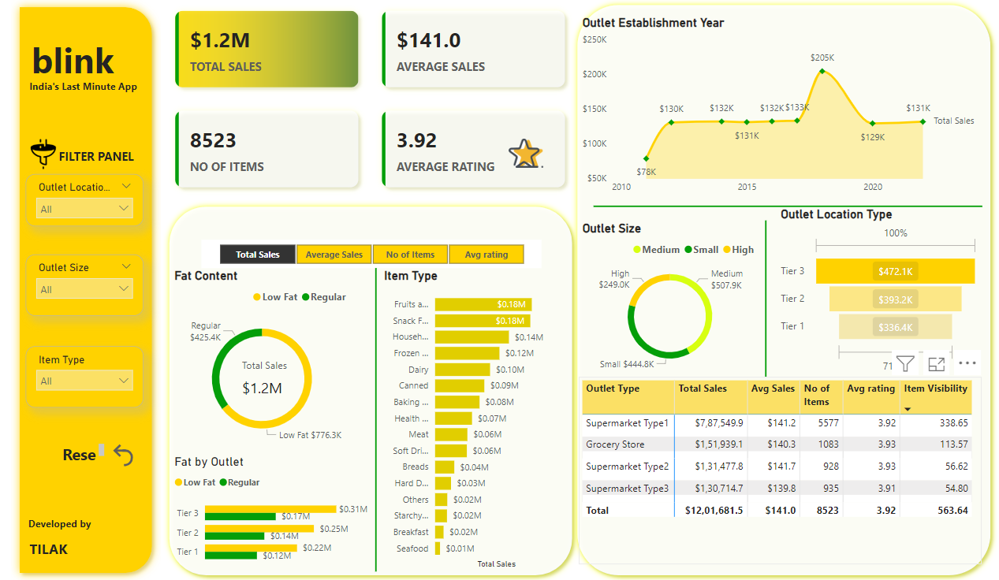
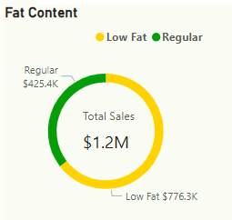
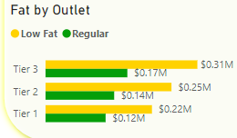
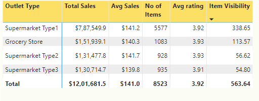

# grocery-sales-insights
This repository contains a Power BI project analyzing grocery sales data with insights on fat content, outlet type, and sales performance.

# Blink Grocery Sales Insights

This project involves the analysis of Blinkit's grocery data to generate actionable insights and visualize key business metrics using Power BI. The primary focus of this project is to understand the impact of various factors, such as item type, outlet size, and location, on total sales and other metrics.

## Business Requirements and Objectives

### KPI Requirements:
1. **Total Sales:** The overall revenue generated from all items sold.
2. **Average Sales:** The average revenue per sale.
3. **Number of Items:** The total count of different items sold.
4. **Average Rating:** The average customer rating for items sold.

### Business Analysis Requirements:
1. **Total Sales by Fat Content**
   - **Objective:** Analyze the impact of fat content on total sales.
   - **Additional KPI Metrics:** Assess how other KPIs (Average Sales, Number of Items, Average Rating) vary with fat content.
   - **Chart Type:** Donut Chart.

2. **Total Sales by Item Type**
   - **Objective:** Identify the performance of different item types in terms of total sales.
   - **Additional KPI Metrics:** Assess how other KPIs vary with item type.
   - **Chart Type:** Bar Chart.

3. **Fat Content by Outlet for Total Sales**
   - **Objective:** Compare total sales across different outlets segmented by fat content.
   - **Additional KPI Metrics:** Assess how other KPIs vary across outlets.
   - **Chart Type:** Stacked Column Chart.

4. **Total Sales by Outlet Establishment**
   - **Objective:** Evaluate how the age or type of outlet establishment influences total sales.
   - **Chart Type:** Line Chart.

5. **Sales by Outlet Size**
   - **Objective:** Analyze the correlation between outlet size and total sales.
   - **Chart Type:** Donut Chart.

6. **Sales by Outlet Location**
   - **Objective:** Assess the geographic distribution of sales across different locations.
   - **Chart Type:** Funnel Map.

7. **All Metrics by Outlet Type**
   - **Objective:** Provide a comprehensive view of all key metrics (Total Sales, Average Sales, Number of Items, Average Rating) broken down by different outlet types.
   - **Chart Type:** Matrix Card.

## Data Cleaning and Preparation

The following steps were performed to clean and preprocess the data:
1. **Replaced Item Fat Content Labels:**
   - Standardized "LF" and "low fat" to "Low Fat."
   - Standardized "reg" to "Regular."
2. **Calculated Metrics Using DAX:**
   - Created KPIs like Total Sales, Average Sales, Number of Items, and Average Rating.

## Insights Generated

1. **Total Sales by Fat Content:**
   - Low Fat items had higher total sales compared to Regular items.
2. **Total Sales by Item Type:**
   - "Fruits and Vegetables" and "Frozen Foods" were the top-performing item types.
3. **Fat Content by Outlet for Total Sales:**
   - Supermarket outlets had a balanced distribution of sales across fat content categories.
4. **Total Sales by Outlet Establishment:**
   - Older outlets consistently showed higher sales compared to newly established outlets.
5. **Sales by Outlet Size:**
   - Medium-sized outlets generated the highest total sales.
6. **Sales by Outlet Location:**
   - Tier 1 locations had the highest total sales, followed by Tier 2 and Tier 3.
7. **All Metrics by Outlet Type:**
   - Supermarkets significantly outperformed grocery stores across all KPIs.

## Tools Used
1. **Power Query:** For data cleaning and transformation.
2. **DAX (Data Analysis Expressions):** For creating KPIs and advanced calculations.
3. **Power BI:** For interactive dashboards and data visualization.

## How to Explore the Dashboard
1. **Filters and Slicers:**
   - Slicers were added for "Outlet Location Type," "Outlet Size," and "Item Type" to allow dynamic filtering.
2. **Interactive Charts:**
   - The visualizations, such as donut charts, bar charts, and stacked column charts, update dynamically based on selected filters.
3. **Drill-Throughs:**
   - Users can drill through specific data points to explore detailed insights.

## How to Access
To access this project:
1. Clone this repository.
2. Open the Power BI file (`blink.pbix`) in Power BI Desktop.
3. Explore the dashboard using interactive filters and slicers.

---

### Conclusion
This project demonstrates an end-to-end analysis of grocery sales data using Power BI. By addressing business requirements and visualizing insights effectively, it showcases proficiency in data analysis and storytelling.

# Grocery Sales Insights Dashboard

This project uses Power BI to analyze grocery sales data and derive key business insights.

## Dashboard Overview

---

## Key Visualizations
### 1. Total Sales by Fat Content

### 2. Fat Content by Outlet for Total Sales

### 3. All Metrics by Outlet Type

